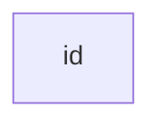
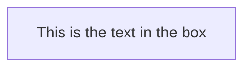
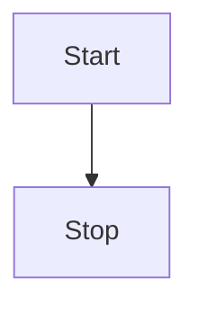
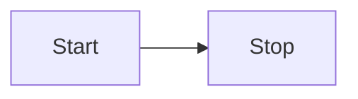
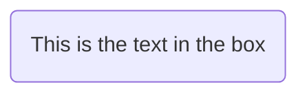
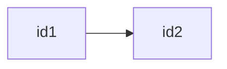

# [Flowchart in programming](https://www.programiz.com/article/flowchart-programming)

## [Flowcharts - Basic Syntax](https://mermaid-js.github.io/mermaid/#/flowchart?id=flowcharts-basic-syntax)

### A node (default)

```txt
graph LR
id
```



> Note: The id is what is displayed in the box.

### A node with text

```txt
graph LR
id1[This is the text in the box]
```



## Graph

```txt
graph TD
Start --> Stop
```



```txt
graph LR
Start --> Stop
```



## Flowchart Orientation

- TB - top to bottom
- RD - top-down/ same as top to bottom
- BT - bottom to top
- RL - right to left
- LR - left to right

## Node shapes

### A node with round edges

```txt
graph LR
id1(This is the text in the box)
```



Symbol|Purpose|Description
-|-|-


